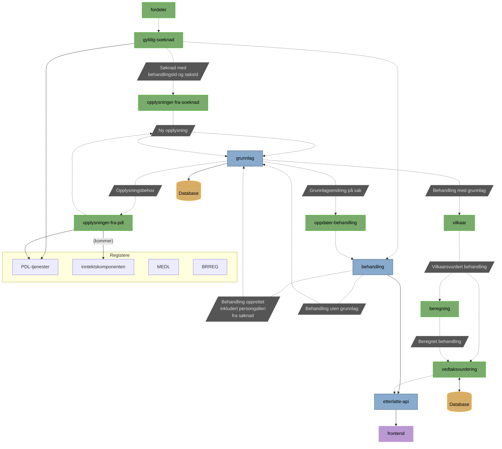

# pensjon-etterlatte-saksbehandling

Monorepoet bruker `husky` for pre-commit-hooks. Denne kjører `Prettier` for frontend og `ktlint` for backend.
Før man starter å kode er det derfor viktig å kjøre `bash get-started.sh` fra Root. Da vil alle de tre overnevnte bli 
installert.

Monorepo for ny saksbehandlingsløsning for ytelser til etterlatte

### AzureAD secrets på lokal maskin

Tokens/secrets som gjør det mulig å gå mot dev-gcp fra lokal maskin.\
Kan hentes ved å kjøre følgende kommando:
```
./get-secret.sh apps/<app_du_vil_lage_secrets_for>
```

Hvis du får feilmelding `Not logged in or lacking rights. Ensure you're connected to naisdevice and gcp.`
og du er sikker på du er koblet både naisdevice og gcp så kan det være at du må sette default namespace på context:

```
kubectl config set-context --current --namespace=etterlatte
```

Ved endring i filen kan denne kommandoen kjøres (OBS: dette innebærer at alle må hente tokens på nytt). Eksempel for etterlatte-saksbehandling-ui:
```
kubectl apply -f apps/etterlatte-saksbehandling-ui/.nais/azuread-etterlatte-saksbehandling-ui-lokal.yaml
```

**NB:** Ved kjøring av en eller flere backend(s) lokalt kan det være lurt å installere
[EnvFile](https://plugins.jetbrains.com/plugin/7861-envfile) i IntelliJ. Uten denne må du manuelt kopiere
fra .env-filen til appen sine miljøvariabler.

## Apper

[etterlatte-api](apps/etterlatte-api) \
Tjeneste som kobler frontend og backend sammen. Kallene gjøres i hovedsak via REST, med unntak av posting av data til grunnlag som lager en kafka-melding.

[etterlatte-behandling](apps/etterlatte-behandling) \
Tjeneste som holder styr på behandlinger.

[etterlatte-beregning](apps/etterlatte-beregning) \
// TODO

[etterlatte-brev-api](apps/etterlatte-brev-api) \
Ktor og Rapid app for å håndtere generering av brev, brevmaler og sende videre til distribusjon.

[etterlatte-brev-distribusjon](apps/etterlatte-brev-distribusjon) \
Rapid app for å distribuere brev. Håndterer journalføring og distribusjon.

[etterlatte-brreg](apps/etterlatte-brreg) \
App med API for å hente data fra enhetsregisteret.

[etterlatte-fordeler](apps/etterlatte-fordeler) \
Fordeler aktuelle saker inn til behandling i ny applikasjon.

[etterlatte-grunnlag](apps/etterlatte-grunnlag) \
Tjeneste som holder styr på behandlinger.

[etterlatte-gyldig-soeknad](apps/etterlatte-gyldig-soeknad) \
// TODO

[etterlatte-hendelser-pdl](apps/etterlatte-hendelser-pdl) \
Lytter på hendelser fra Livet er en strøm av hendelser

[etterlatte-medl-proxy](apps/etterlatte-medl-proxy) \
Oppslagstjeneste mot medlemskapsregistret (folketrygden).

[etterlatte-oppdater-behandling](apps/etterlatte-oppdater-behandling) \
Oppdater behandling er en Rapid-app, som brukes til å lese meldinger relevant for behandlings-appen og sende HTTP-kall til behandlingsappen for å gjøre forskjellige handlinger.

[etterlatte-opplysninger-fra-inntektskomponenten](apps/etterlatte-opplysninger-fra-inntektskomponenten) \
Enkel Rapids&River-app som svarer på behov om opplysning INNTEKT.

[etterlatte-opplysninger-fra-pdl](apps/etterlatte-opplysninger-fra-pdl) \
// TODO

[etterlatte-opplysninger-fra-soeknad](apps/etterlatte-opplysninger-fra-soeknad) \
// TODO

[etterlatte-overvaaking](apps/etterlatte-overvaaking) \
// TODO

[etterlatte-pdltjenester](apps/etterlatte-pdltjenester) \
// TODO

[etterlatte-saksbehandling-ui](apps/etterlatte-saksbehandling-ui) \
Appen består av en statisk frontend og en backend-for-frontends i NodeJS.

[etterlatte-testdata](apps/etterlatte-testdata) \
App for forenkling av manuell testing.

[etterlatte-tilbakekreving](apps/etterlatte-tilbakekreving) \
Mottar tilbakekrevingsvedtak fra Tilbakekrevingskomponenten til Oppdrag

[etterlatte-utbetaling](apps/etterlatte-utbetaling) \
Oversetter vedtak til et format som kan oversendes til oppdrag.

[etterlatte-vedtaksvurdering](apps/etterlatte-vedtaksvurdering) \
Tjeneste som tilbyr forslag til vedtak som kan fattes og attesteres

[etterlatte-vilkaar-kafka](apps/etterlatte-vilkaar-kafka) \
// TODO

# Flytdiagram

### Hvordan appene samarbeider



# Bygg og deploy

En app bygges og deployes automatisk når en endring legges til i `main`.

For å trigge **manuell deploy** kan du gå til `Actions -> (velg workflow) -> Run workflow from <branch>`

## Lokal bygg/test - docker

Docker må være installert og kjørende for at lokal bygg/test skal fungere. Hvis man bruker docker desktop så klarer testene
å finne docker socket automatisk. Hvis man har colima kjørende så må man ha en symlink:

```
sudo ln -sf $HOME/.colima/default/docker.sock /var/run/docker.sock
```

# Varsling
Det legges ut varsler om feilmeldinger i appene på Slack i kanalen `#team-etterlatte-alerts-dev` og `#team-etterlatte-alerts-prod`

# Henvendelser

Spørsmål knyttet til koden eller prosjektet kan stilles som issues her på GitHub.

## For NAV-ansatte

Interne henvendelser kan sendes via Slack i kanalen #po-pensjon-team-etterlatte.

