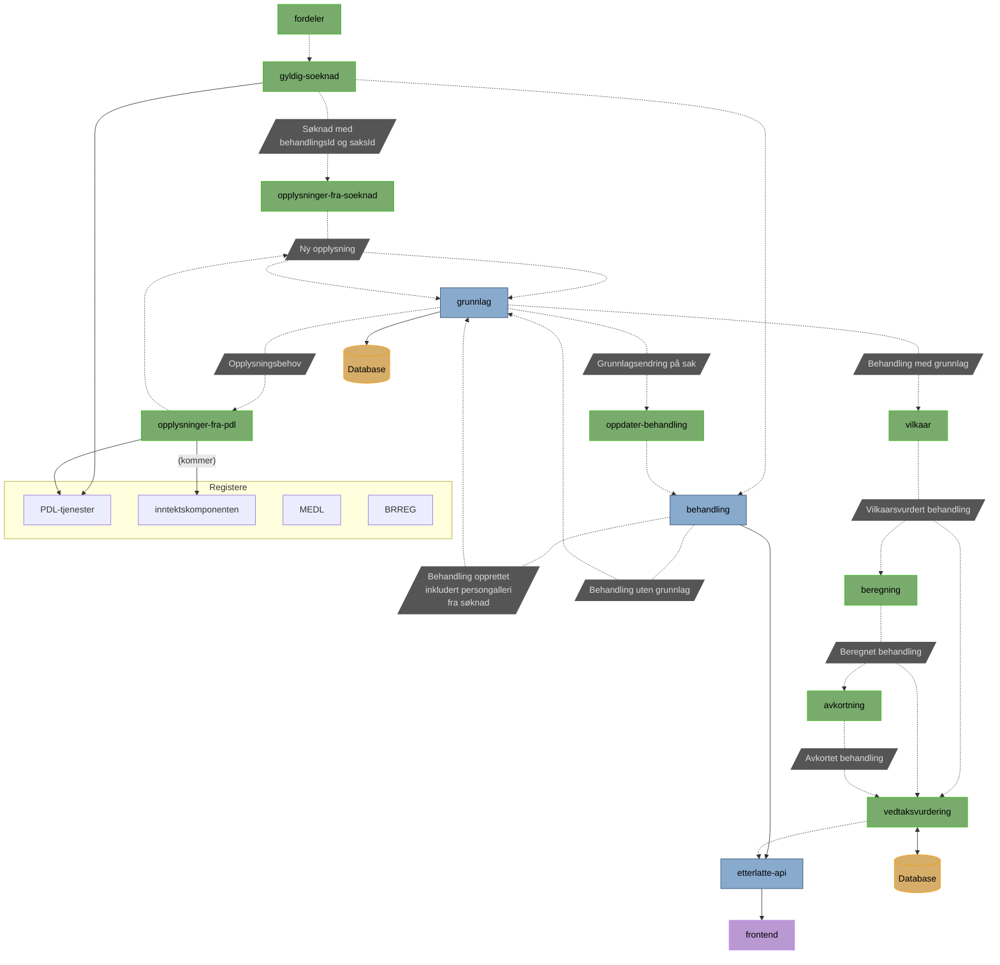

# pensjon-etterlatte-saksbehandling

Monorepoet bruker `husky` for pre-commit-hooks. Denne kjører `Prettier` for frontend og `ktlint` for backend.
Før man starter å kode er det derfor viktig å kjøre `bash get-started.sh` fra Root. Da vil alle de tre overnevnte bli 
installert.

Monorepo for ny saksbehandlingsløsning for ytelser til etterlatte

## Apper

[etterlatte-api](apps/etterlatte-api) \
// TODO

[etterlatte-avkorting](apps/etterlatte-avkorting) \
// TODO

[etterlatte-behandling](apps/etterlatte-behandling) \
Tjeneste som holder styr på behandlinger.

[etterlatte-beregning](apps/etterlatte-beregning) \
// TODO

[etterlatte-fordeler](apps/etterlatte-fordeler) \
Fordeler aktuelle saker inn til behandling i ny applikasjon.

[etterlatte-grunnlag](apps/etterlatte-grunnlag) \
Tjeneste som holder styr på behandlinger.

[etterlatte-gyldig-soeknad](apps/etterlatte-gyldig-soeknad) \
// TODO

[etterlatte-utbetaling](apps/etterlatte-utbetaling) \
Oversetter vedtak til et format som kan oversendes til oppdrag.

[etterlatte-oppdater-behandling](apps/etterlatte-oppdater-behandling) \
// TODO

[etterlatte-opplysninger-fra-inntektskomponenten](apps/etterlatte-opplysninger-fra-inntektskomponenten) \
// TODO

[etterlatte-opplysninger-fra-pdl](apps/etterlatte-opplysninger-fra-pdl) \
// TODO

[etterlatte-opplysninger-fra-soeknad](apps/etterlatte-opplysninger-fra-soeknad) \
// TODO

[etterlatte-overvaaking](apps/etterlatte-overvaaking) \
// TODO

[etterlatte-pdltjenester](apps/etterlatte-pdltjenester) \
// TODO

[etterlatte-saksbehandling-ui](apps/etterlatte-saksbehandling-ui) \
Appen består av en statisk frontend og en backend-for-frontends i NodeJS.

[etterlatte-testdata](apps/etterlatte-testdata) \
// TODO

[etterlatte-vedtaksvurdering](apps/etterlatte-vedtaksvurdering) \
// TODO

[etterlatte-vilkaar-kafka](apps/etterlatte-vilkaar-kafka) \
// TODO

# Flytdiagram

### Hvordan appene samarbeider

# Bygg og deploy

En app bygges og deployes automatisk når en endring legges til i `main`.

For å trigge **manuell deploy** kan du gå til `Actions -> (velg workflow) -> Run workflow from <branch>`

# Henvendelser

Spørsmål knyttet til koden eller prosjektet kan stilles som issues her på GitHub.

## For NAV-ansatte

Interne henvendelser kan sendes via Slack i kanalen #po-pensjon-team-etterlatte.
