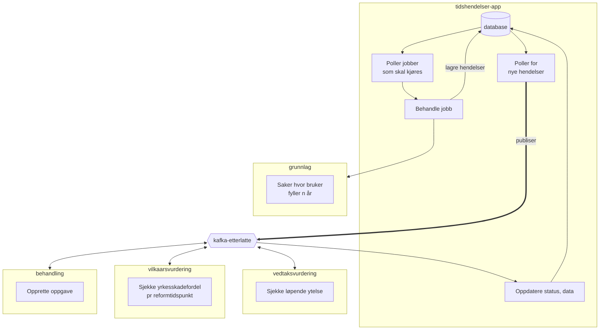

# etterlatte-tidshendelser

Denne appen styrer jobber som kjører med jevne mellomrom for å håndtere nettopp det at tiden går, og som dermed medfører at saker må behandles på nytt, mtp f.eks. opphør av barnepensjon når vedkommende når en viss alder.

## Jobber - scenarier

- Aldersovergang
  - Opphør barnepensjon ved fylte 20 år
    - Utvidet aldersgrense til 21 år dersom yrkesskadefordel før 01.01.2024 (Reformtidspunkt)
  - Opphør barnepensjon ved fylte 21 år

## Oversikt

### Teknologi
kotlin/ktor, postgres, kakfa (rapids & rivers)

## Lokal utvikling

Les [README](../../README.md) på rot i prosjektet.

