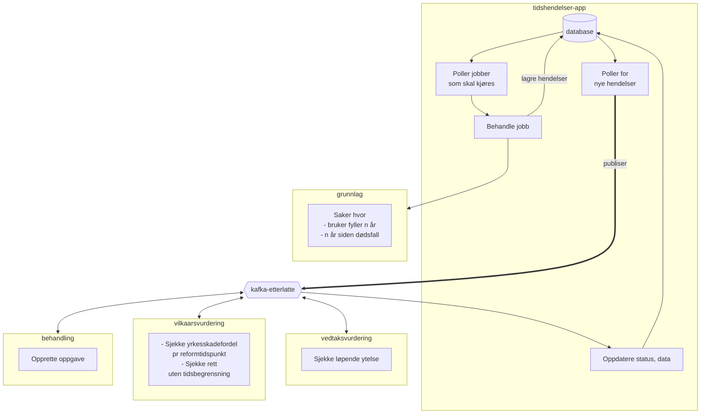

# etterlatte-tidshendelser

Denne appen styrer jobber som kjører med jevne mellomrom for å håndtere nettopp det at tiden går, og som dermed medfører at saker må behandles på nytt, mtp f.eks. opphør av barnepensjon når vedkommende når en viss alder.

## Jobber - scenarier

- Aldersovergang
  - `AO_BP20` Opphør barnepensjon ved fylte 20 år
    - Unntak: utvidet aldersgrense til 21 år dersom yrkesskadefordel før 01.01.2024 (Reformtidspunkt)
  - `AO_BP21` Opphør barnepensjon ved fylte 21 år
  - `AO_OMS67` Opphør omstillingsstønad ved fylte 67 år
- Omstillingsstønad
  - `OMS_DOED_3AAR` Opphør omstillingsstønad 3 år etter dødsfall
    - Unntak: har rett uten tidsbegrensning
    - NB: Mangler sjekk for utvidelse med 2 år (sannsynligvis nytt vilkår) 
  - `OMS_DOED_5AAR` Opphør utvidet omstillingsstønad, (3 + 2) år etter dødsfall
    - Unntak: har rett uten tidsbegrensning  
- Regulering
  - For å trigge denne jobben gjøres følgende:
  1. Gå inn i Unleash og aktiver flagget start-regulering
  2. Restart applikasjonen, for eksempel ved å slette podden (kubectl delete pod) eller redeploye 
  3. Etter endt kjøring, skru av reguleringsflagget igjen

## Oversikt

### Teknologi
kotlin/ktor, postgres, kakfa (rapids & rivers)

## Lokal utvikling

Les [README](../../README.md) på rot i prosjektet.

