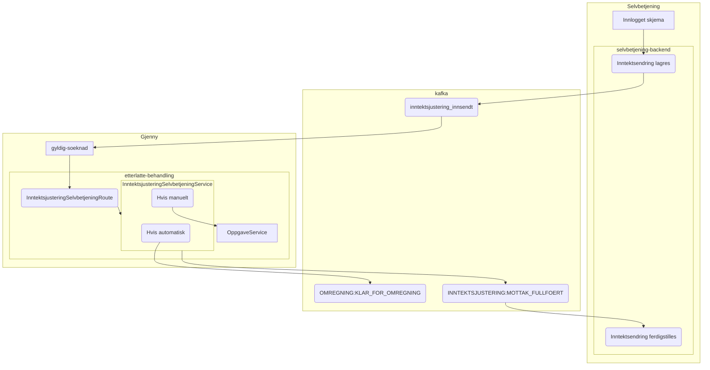
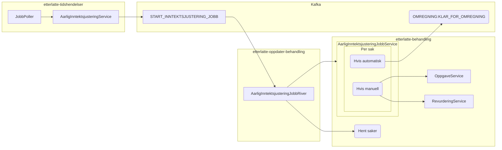

# Inntektsjustering

## Innhold

1. [Om inntektsjustering](#om-inntektsjustering)
2. [Årlig varselbrev og utkast inntektsjustering](#årlig-varselbrev-og-utkast-inntektsjustering)
3. [Automatisk behandling inntektsendring](#automatisk-behandling-inntektsendring)

## Om inntektsjustering

[Les mer inntektsjusterig på Confluence.](https://confluence.adeo.no/display/TE/Inntektsjustering)

## Automatisk behandling inntektsendring

[Løsningsbeskrivelse på Confluence.](https://confluence.adeo.no/display/TE/Automatisk+behandling+av+inntektjustering)

### Flyt oppstart av automatisk behandling

[Mer detaljert flyt for oversending av inntektsendring fra selvbetjening](https://github.com/navikt/pensjon-etterlatte/tree/main/apps/selvbetjening-backend)

### Bruk av omregning

Når hendelse KLAR_FOR_OMREGNING er sendt blir endring automatisk behandlet
av [omregningsflyten](../etterlatte-omregning-model/README.md).

Automatisk behandling av inntektsendring har egen logikk noen av stegene:

* Når hendelse om omregning sendes
  blir [OmregningsData](../etterlatte-omregning-model/src/main/kotlin/omregning/Omregning.kt)
  populert
  med [Inntektsjustering](./src/main/kotlin/no.nav.etterlatte.libs.inntektsjustering/MottattInntektsjustering.kt).
* Behandling skal bruke brev derfor blir brevutfall satt
  i [OmregningsHendelserBehandlingRiver](../../apps/etterlatte-oppdater-behandling/src/main/kotlin/regulering/OmregningsHendelserBehandlingRiver.kt).
* Ny inntekt blir anvendt i
  beregningsteg ([OmregningsHendelserBehandlingRiver](../../apps/etterlatte-beregning-kafka/src/main/kotlin/no/nav/etterlatte/beregningkafka/OmregningHendelserBeregningRiver.kt))
  ved å
  bruke [MottattInntektsjusteringService](../../apps/etterlatte-beregning/src/main/kotlin/avkorting/MottattInntektsjusteringService.kt).
* Vedtaksbrev opprettes og vedtak fattes
  i [OpprettVedtakforespoerselRiver](../../apps/etterlatte-vedtaksvurdering-kafka/src/main/kotlin/no/nav/etterlatte/regulering/OpprettVedtakforespoerselRiver.kt)
  uten å attestere.

## Årlig varselbrev og utkast inntektsjustering

[Løsningsbeskrivelse på Confluence.](https://confluence.adeo.no/pages/viewpage.action?pageId=641029651)

## Bruk av Omregning

Når hendelse KLAR_FOR_OMREGNING er sendt gjøres en automatisk behandling med et varselbrev og vedtaksbrev
ved å bruke [omregningsflyten](../etterlatte-omregning-model/README.md).

Automatisk behandling av inntektsendring har egen logikk noen av stegene:

* Behandling skal bruke brev derfor blir brevutfall satt
  i [OmregningsHendelserBehandlingRiver](../../apps/etterlatte-oppdater-behandling/src/main/kotlin/regulering/OmregningsHendelserBehandlingRiver.kt).
* I
  beregningsteg ([OmregningsHendelserBehandlingRiver](../../apps/etterlatte-beregning-kafka/src/main/kotlin/no/nav/etterlatte/beregningkafka/OmregningHendelserBeregningRiver.kt))
  videreføres siste oppgitte inntekt til neste år ved å
  bruke [AarligInntektsjusteringService](../../apps/etterlatte-beregning/src/main/kotlin/avkorting/AarligInntektsjusteringService.kt).
* Vedtak og brev opprettes
  i [OpprettVedtakforespoerselRiver](../../apps/etterlatte-vedtaksvurdering-kafka/src/main/kotlin/no/nav/etterlatte/regulering/OpprettVedtakforespoerselRiver.kt).

### Statusflyt

Når automatisk behandling gjøres på en sak blir det lagt til linjer med status i tabell omregningskjoering i
etterlatte-behandling.

Hvis en sak kan automatisk behandles helt til iverksatt er flyten: KLAR_FOR_OMREGNING > STARTA  > FERDIGSTILT

Hvis en sak må behandles manuelt blir det lagt til en linje med status TIL_MANUELL eller TIL_MANUELL_UTEN_OPPGAVE (hvis
feature toggle aarlig-inntektsjustering-la-manuell-behandling er på).

Hvis en sak ikke skal gjennomføres (f.eks hvis ikke løpende) settes status rett til FERDIGSTILT men med en begrunnelse.

Hvis det feiler i et steg i flyten vil status settes til FEILA med begrunnelse.

### Brev og distribuering

Når automatisk behandling er iverksatt og brev distribuert vil [OmregningBrevDistribusjonRiver ]()TODO fange det opp
og oppatere omregningskjoering ved å sette feltet distribuert_brev til true.
