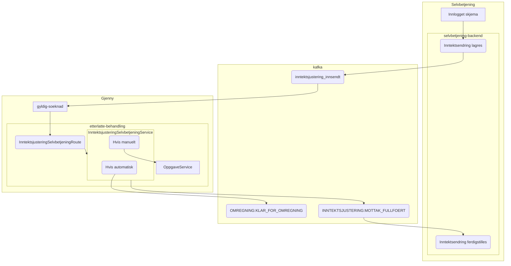

# Inntektsjustering

## Innhold

1. [Om inntektsjustering](#om-inntektsjustering)
2. [Årlig varselbrev og utkast inntektsjustering](#årlig-varselbrev-og-utkast-inntektsjustering)
3. [Automatisk behandling inntektsendring](#automatisk-behandling-inntektsendring)

## Om inntektsjustering

[Les mer inntektsjusterig på Confluence.](https://confluence.adeo.no/display/TE/Inntektsjustering)

## Automatisk behandling inntektsendring

[Løsningsbeskrivelse på Confluence.](https://confluence.adeo.no/display/TE/Automatisk+behandling+av+inntektjustering)

### Flyt oppstart av automatisk behandling

[Mer detaljert flyt for oversending av inntektsendring fra selvbetjening](https://github.com/navikt/pensjon-etterlatte/tree/main/apps/selvbetjening-backend)



### Bruk av omregning

Når hendelse KLAR_FOR_OMREGNING er sendt blir endring automatisk behandlet
av [omregningsflyten](../etterlatte-omregning-model/README.md).

Automatisk behandling av inntektsendring har egen logikk noen av stegene:

* Når hendelse om omregning sendes
  blir [OmregningsData](../etterlatte-omregning-model/src/main/kotlin/omregning/Omregning.kt)
  populert
  med [Inntektsjustering](./src/main/kotlin/no.nav.etterlatte.libs.inntektsjustering/MottattInntektsjustering.kt).
* Behandling skal bruke brev derfor blir brevutfall satt
  i [OmregningsHendelserBehandlingRiver](../../apps/etterlatte-oppdater-behandling/src/main/kotlin/regulering/OmregningsHendelserBehandlingRiver.kt).
* Ny inntekt blir anvendt i
  beregningsteg ([OmregningsHendelserBehandlingRiver](../../apps/etterlatte-beregning-kafka/src/main/kotlin/no/nav/etterlatte/beregningkafka/OmregningHendelserBeregningRiver.kt))
  ved å
  bruke [MottattInntektsjusteringService](../../apps/etterlatte-beregning/src/main/kotlin/avkorting/MottattInntektsjusteringService.kt).
* Vedtaksbrev opprettes og vedtak fattes
  i [OpprettVedtakforespoerselRiver](../../apps/etterlatte-vedtaksvurdering-kafka/src/main/kotlin/no/nav/etterlatte/regulering/OpprettVedtakforespoerselRiver.kt)
  uten å attestere.

## Årlig varselbrev og utkast inntektsjustering

[Løsningsbeskrivelse på Confluence.](https://confluence.adeo.no/pages/viewpage.action?pageId=641029651)

```mermaid

```
