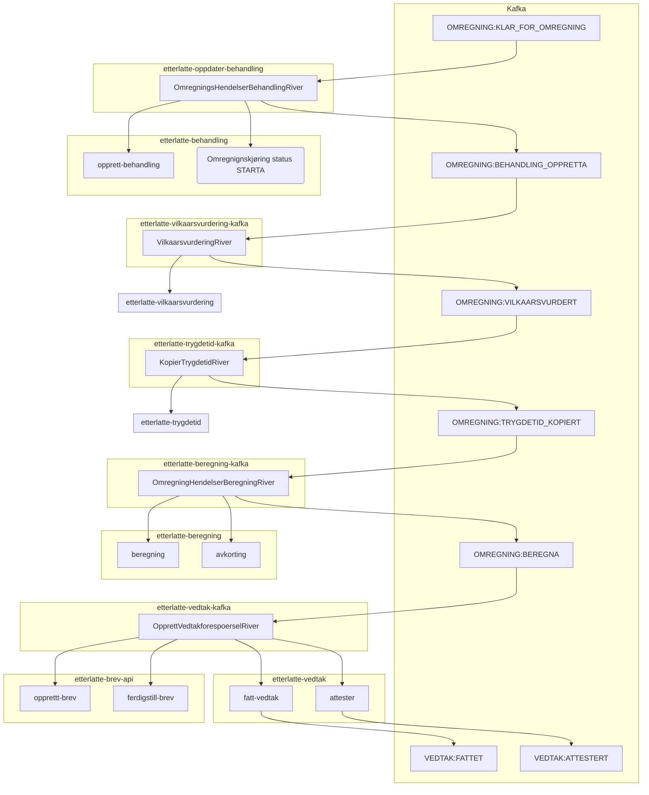
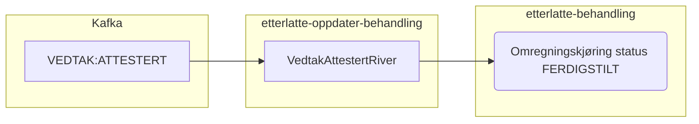
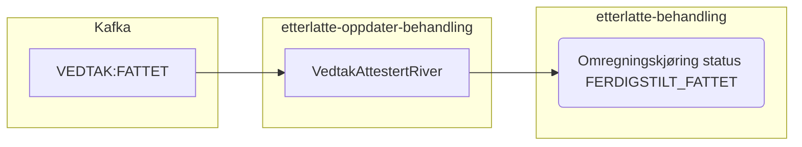
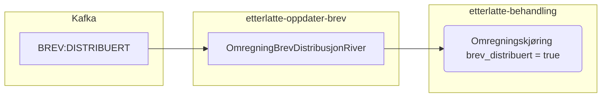

# Omregning - Automatisk behandling

```mermaid
flowchart
    subgraph Kafka
        OMREGNING:KLAR_FOR_OMREGNING
        OMREGNING:BEHANDLING_OPPRETTA
        OMREGNING:VILKAARSVURDERT
        OMREGNING:TRYGDETID_KOPIERT
        OMREGNING:BEREGNA
        VEDTAK:FATTET
        VEDTAK:ATTESTERT
    end
    subgraph etterlatte-oppdater-behandling
        OmregningsHendelserBehandlingRiver
    end
    subgraph etterlatte-behandling
        opprett-behandling
        omregningkjoering-starta(Omregnignskjøring status STARTA)
    end
    subgraph etterlatte-vilkaarsvurdering-kafka
        VilkaarsvurderingRiver
    end
    subgraph etterlatte-vilkaarsvurdering
    end
    subgraph etterlatte-trygdetid-kafka
        KopierTrygdetidRiver
    end
    subgraph etterlatte-trygdetid
    end
    subgraph etterlatte-beregning-kafka
        OmregningHendelserBeregningRiver
    end
    subgraph etterlatte-beregning
        beregning
        avkorting
    end
    subgraph etterlatte-vedtak-kafka
        OpprettVedtakforespoerselRiver
    end
    subgraph etterlatte-vedtak
        fatt-vedtak
        attester
    end
    subgraph etterlatte-brev-api
        opprettt-brev
        ferdigstill-brev
    end

    OMREGNING:KLAR_FOR_OMREGNING --> OmregningsHendelserBehandlingRiver
    OmregningsHendelserBehandlingRiver --> opprett-behandling
    OmregningsHendelserBehandlingRiver --> omregningkjoering-starta
    OmregningsHendelserBehandlingRiver --> OMREGNING:BEHANDLING_OPPRETTA
    OMREGNING:BEHANDLING_OPPRETTA --> VilkaarsvurderingRiver
    VilkaarsvurderingRiver --> etterlatte-vilkaarsvurdering
    VilkaarsvurderingRiver --> OMREGNING:VILKAARSVURDERT
    OMREGNING:VILKAARSVURDERT --> KopierTrygdetidRiver
    KopierTrygdetidRiver --> etterlatte-trygdetid
    KopierTrygdetidRiver --> OMREGNING:TRYGDETID_KOPIERT
    OMREGNING:TRYGDETID_KOPIERT --> OmregningHendelserBeregningRiver
    OmregningHendelserBeregningRiver --> beregning
    OmregningHendelserBeregningRiver --> avkorting
    OmregningHendelserBeregningRiver --> OMREGNING:BEREGNA
    OMREGNING:BEREGNA --> OpprettVedtakforespoerselRiver
    OpprettVedtakforespoerselRiver --> fatt-vedtak
    OpprettVedtakforespoerselRiver --> opprettt-brev
    OpprettVedtakforespoerselRiver --> ferdigstill-brev
    OpprettVedtakforespoerselRiver --> attester
    fatt-vedtak --> VEDTAK:FATTET
    attester --> VEDTAK:ATTESTERT
```

### Hvis hel automaatisk (til iverksatt)

```mermaid
flowchart LR
    subgraph Kafka
        VEDTAK:ATTESTERT
    end
    subgraph etterlatte-oppdater-behandling
        VedtakAttestertRiver
    end
    subgraph etterlatte-behandling
        omregning-ferdig(Omregningskjøring status FERDIGSTILT)
    end
    VEDTAK:ATTESTERT --> VedtakAttestertRiver
    VedtakAttestertRiver --> omregning-ferdig
```

### Hvis del automaatisk (til fattet)

```mermaid
flowchart LR
    subgraph Kafka
        VEDTAK:FATTET
    end
    subgraph etterlatte-oppdater-behandling
        VedtakAttestertRiver
    end
    subgraph etterlatte-behandling
        omregning-ferdig(Omregningskjøring status FERDIGSTILT_FATTET)
    end
    VEDTAK:FATTET --> VedtakAttestertRiver
    VedtakAttestertRiver --> omregning-ferdig
```

### Hvis vedtaksbrev

```mermaid
flowchart LR
    subgraph Kafka
        BREV:DISTRIBUERT
    end
    subgraph etterlatte-oppdater-brev
        OmregningBrevDistribusjonRiver
    end
    subgraph etterlatte-behandling
        omregning-brev(Omregningskjøring brev_distribuert = true)
    end

    BREV:DISTRIBUERT --> OmregningBrevDistribusjonRiver
    OmregningBrevDistribusjonRiver --> omregning-brev
```